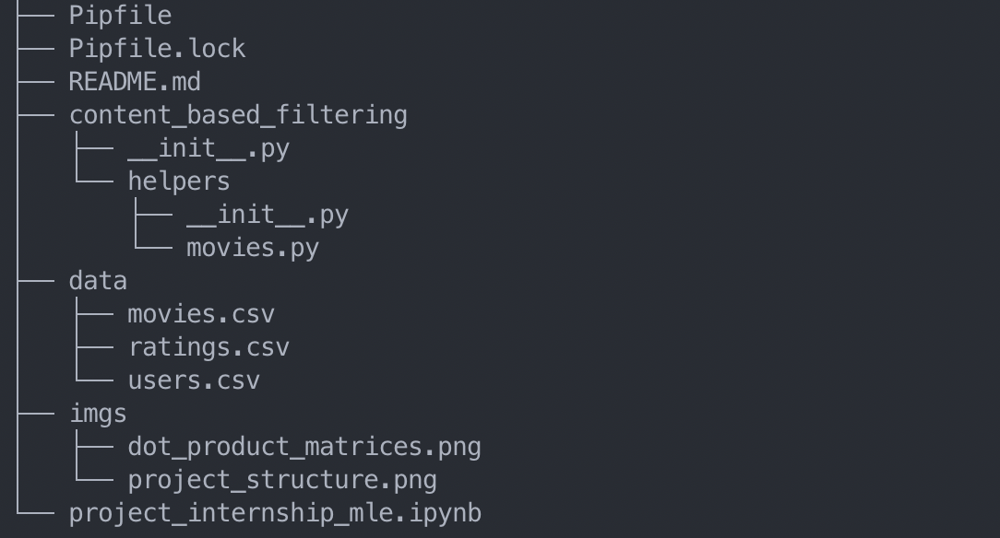

# Interview project for TinyClues MLE Internship

## Introduction

This is the interview project that any applicant to our MLE internship position receives.

The current structure is the following:


The [notebook](project_internship_mle.ipynb) holds the necessary information to complete this exercise.
In order to run it, we provide you with a jupyter-lab that you shall install following the [Setup environment section](#setup-the-environment)

The code you'll find is a naive implementation with number of shortcomings preventing 
the collaboration of multiple MLE and Data Scientists:
- It is not possible to introduce easily new features mainly because the code is just a bunch of functions in one file.
- The code can not be scaled to other datasets or variations of the tasks.
- There is no evaluation of the performances.
- There is no testing

Additionaly, if you think of any features that would be an interesting, feel free to add them.  
For example, what about looking at similar users to find a recommendation for our targeted user ?

## Answer modalities

We expect you to provide us with a invitation link to a fork of this repository. It shall be hosted on `github`.  
Within it, we shall find your source code and anything you think is necessary.


## Setup the environment
Run the following commands in your development environment
```bash
$ pip install pipenv
$ pipenv install
```

### Test that everything is working
Check that you can run the notebook:
```bash
$ pipenv run jupyter-lab
```
:warning: Execute every cells of the notebook just to be sure that everything is running smoothly.
